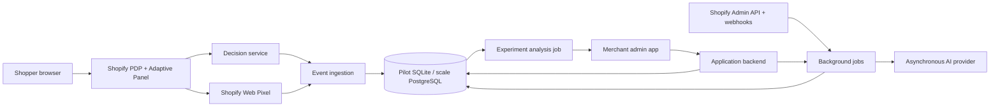

# RFC-001: Adaptive Storefront Pilot Architecture

Development update (2026-09-06): the owner authorized the adaptive scope in [doc60](./60-adaptive-storefront-prd.md), with Luna implementing under [doc63](./63-luna-development-brief.md) and milestones tracked in [doc64](./64-adaptive-development-status.md). Earlier contracts and verification below remain historical/implemented baselines, not evidence that the new scope is built. New protocol changes must be versioned and reviewed; no active registrations or production authority change through this notice.

Status: Implemented capped public-beta profile  
Version: 0.3  
Date: 2026-09-02  
Owners: Engineering/Product/Data

## Summary

Build a Shopify application that renders one versioned adaptive panel on selected PDPs, assigns eligible visitors to fixed experiment policies, captures commerce events and reconciles decisions with server-side orders.

The architecture favors auditability and failure safety over premature scale. The capped founding beta uses SQLite WAL on an encrypted durable volume with one writer, an explicit maximum store count, verified online backups, and restore drills. Managed PostgreSQL with point-in-time recovery is a hard gate before removing the cap, exceeding the measured single-writer capacity envelope, or running multiple application instances. A separate warehouse, vector database, workflow engine and contextual bandit are deferred until observed load or product needs justify them.

## Goals

- Demonstrate deterministic acquisition-angle-to-experience matching.
- Run visitor-sticky randomized experiments.
- Keep language models out of the storefront runtime path.
- Preserve original-page behavior during failures.
- Produce a reproducible decision-to-order dataset.
- Support merchant approval, pause and content audit.
- Meet the performance and privacy requirements in the PRD.

## Non-goals

- Arbitrary mutation of native theme blocks.
- Multiple independent placements.
- Headless storefront support.
- Checkout UI modification.
- Real-time generative content.
- Contextual bandits or component-level learning.
- Cross-merchant feature sharing.
- Global multi-region active-active deployment during the first pilot.

## Platform choices

### Shopify application

- TypeScript.
- Shopify's supported React Router app template.
- Shopify App Bridge and Polaris-compatible admin UI.
- GraphQL Admin API with an explicitly pinned supported version.
- Theme App Extension containing one `adaptive_panel` app block.
- Web Pixel app extension for standard commerce events.
- Mandatory Shopify privacy webhooks and application uninstall handling.

### Pilot backend

- SQLite on an encrypted durable volume for configuration, content, assignments, normalized events and experiment results during the one-partner pilot.
- Database-backed scheduler state for ingestion recovery, guardrails, retention and alerts.
- S3-compatible object storage only when snapshots or exported reports require it.
- Shopify CDN for the storefront runtime asset; application service and indexed database lookup for immutable experience payloads.
- One application/decision service deployed in the merchant traffic region.
- Provider-independent generation boundary; the initial safe generator is deterministic and source-bound.

Move first to managed PostgreSQL before removing the founding-beta cap or adding writers. Introduce ClickHouse only after PostgreSQL query/load measurements justify it, and pgvector only when semantic retrieval or evidence volume requires it.

## System context



## Storefront integration

### Adaptive Panel block

The Theme App Extension exposes one section-targeted app block.

Responsibilities:

- identify merchant, product, template, market and locale;
- load the minimal runtime script from Shopify CDN;
- reserve treatment layout safely without leaving space for original;
- request or compute assignment;
- render only an approved immutable experience version;
- publish a custom decision/render event for the Web Pixel bridge;
- hide itself on invalid configuration or error.

The block must not:

- replace title, price, media, variant selectors or add-to-cart controls;
- infer claims or call an LLM;
- insert itself into arbitrary DOM selectors;
- prevent the surrounding product section from rendering.

### Placement

Use Shopify's app-block deep-link flow and verify activation in the published theme. Pilot operators inspect the selected product template and guide placement near the buy box.

Only one block is installed per targeted template. Theme source files remain unmodified.

### Rendering strategy

Preferred pilot strategy:

1. Liquid renders a hidden/inert container and non-sensitive bootstrap configuration.
2. Runtime resolves eligibility and assignment.
3. Approved content is read from a versioned edge payload.
4. Treatment content is committed in one DOM operation.
5. A render-result event is published.

Where the explicit angle and experience library can be safely resolved locally, choose content without a network round trip. The decision service remains the authoritative path for experiment assignment and diagnostics when persistence or updated configuration is required.

Prevent flash and layout shift by using a skeleton only for treatment-assigned views when assignment is available early. Original views must remove the container entirely.

## Decision API

### Request

```json
{
  "merchantKey": "public-store-key",
  "productId": "gid://shopify/Product/123",
  "templateKey": "product.default",
  "visitorId": "opaque-id",
  "sessionId": "opaque-id",
  "landingContext": {
    "source": "meta",
    "campaign": "run_q3",
    "content": "knee_video_02",
    "explicitAngle": null,
    "referrerOrigin": "instagram.com"
  },
  "market": "US",
  "locale": "en-US",
  "deviceClass": "mobile",
  "consentState": "analytics_allowed"
}
```

Do not send full referrer URLs, arbitrary query parameters or PII. Normalize and allow-list fields in the browser before transmission.

### Response

```json
{
  "decisionId": "dec_...",
  "experimentId": "exp_...",
  "experimentVersion": 3,
  "arm": "matched",
  "policy": "MATCHED",
  "acquisitionAngle": "comfort",
  "experienceVersion": "expv_...",
  "contentUrl": "https://cdn.example/immutable/expv_....json",
  "expiresAt": "2026-09-09T12:00:00Z"
}
```

Original, ineligible and failure-safe decisions return `experienceVersion: null`.

### Service requirements

- Authenticate stores with a public non-secret key bound to allowed storefront origins.
- Validate product, locale and active experiment configuration.
- Reuse existing visitor assignment when permitted.
- Otherwise compute deterministic assignment from the registered experiment salt.
- Resolve the recorded mapping version.
- Select only approved, active content matching product/market/locale scope.
- Write or enqueue an immutable decision record.
- Return within p95 75 ms under pilot load.

If configuration, persistence or content validation fails, return original.

### Caching

Cache immutable content by:

```text
merchant × product × market × locale × experience_version
```

Cache active runtime configuration by:

```text
merchant × product × template × market × locale × experiment_version
```

Configuration cache TTL should be short enough for a pause to take effect within five minutes. A separate globally checked kill-switch value may use a shorter TTL.

Never overwrite content at an existing versioned URL.

## Identity, consent and persistence

### Identifiers

- `visitor_id`: opaque first-party identifier when allowed.
- `session_id`: opaque identifier scoped to a browsing session.
- `shopify_client_id`: Shopify-provided pixel identifier when available.
- `decision_id`: server-generated immutable ID.

No identifier contains email, customer ID, IP address or campaign text.

### Consent behavior

Implement a documented matrix for Shopify's preferences, analytics and marketing permissions.

At minimum:

- do not set non-essential persistent identifiers when permission is absent;
- allow the Shopify Web Pixel sandbox to honor configured consent requirements;
- do not transmit behavioral analytics before the required permission;
- use a session-only original or predeclared no-storage path when persistence is unavailable;
- record the applicable consent category/state with each collected event;
- never fingerprint to recover identity.

Legal review must decide whether contextual message selection without persistent tracking is treated as preference or marketing processing in each supported region.

### Event bridge

The storefront runtime and Web Pixel execute in different environments. Publish an allow-listed custom analytics event containing opaque decision/session identifiers, then subscribe to it in the pixel extension. Validate this bridge during A/A testing and accelerated checkout flows.

## Event ingestion

### Event envelope

```json
{
  "eventId": "evt_...",
  "schemaVersion": 1,
  "merchantId": "mer_...",
  "occurredAt": "2026-09-02T12:00:00Z",
  "receivedAt": "2026-09-02T12:00:01Z",
  "eventType": "product_added_to_cart",
  "visitorId": "opaque-id-or-null",
  "sessionId": "opaque-id",
  "decisionId": "dec_...-or-null",
  "experimentId": "exp_...-or-null",
  "productId": "gid://shopify/Product/123",
  "consentState": "analytics_allowed",
  "payload": {}
}
```

### Ingestion rules

- Validate schema and merchant binding.
- Generate or verify idempotency key.
- Retain raw receipt separately from normalized projections.
- Reject unexpected PII fields.
- Acknowledge quickly and process asynchronously.
- Quarantine invalid events instead of silently dropping them.
- Measure duplicate, late and out-of-order rates.

### Required sources

- storefront runtime for decision and render outcome;
- Shopify Web Pixel for product/cart/checkout events;
- Shopify order and refund webhooks for final reconciliation;
- Admin API backfill for missed or delayed webhook recovery.

The pixel `checkout_completed` event is a timely signal, not the final revenue ledger.

## Order association

Where Shopify permits, attach an opaque decision/session reference to cart attributes so it survives into the order. Do not expose experiment meaning or personal data in the attribute.

Use join methods in descending confidence:

1. order/cart attribute containing decision reference;
2. validated checkout/session bridge;
3. Shopify client identifier linkage under permitted processing;
4. no join.

Record `join_method` and never silently use probabilistic matching for the primary result.

Test standard checkout, Shop Pay, accelerated buttons and multi-session purchase paths.

## Data model

### Configuration and content

- `merchants`
- `merchant_installations`
- `products`
- `source_documents`
- `evidence_objects`
- `claims`
- `reviews`
- `acquisition_angles`
- `campaign_mappings`
- `experience_bundles`
- `experience_versions`
- `approvals`
- `experiments`
- `experiment_versions`
- `experiment_arms`

### Runtime and outcomes

- `visitors`
- `sessions`
- `assignments`
- `decisions`
- `render_events`
- `commerce_events`
- `orders`
- `refunds`
- `order_attributions`
- `experiment_results`
- `data_quality_snapshots`
- `incidents`
- `audit_log`

### Invariants

- Every experience version is immutable.
- Every active experience is approved and evidence-complete.
- Every decision points to a frozen experiment and mapping version.
- Every assignment records its randomization unit and salt version.
- Every attributed order records the join method.
- Merchant-scoped rows include `merchant_id` and are protected by application authorization; row-level database controls are preferred.

## Content intelligence pipeline

```mermaid
flowchart LR
    Sync["Catalog/policy/review sync"] --> Snapshot["Immutable source snapshot"]
    Snapshot --> Extract["Claim and benefit extraction"]
    Extract --> Validate["Deterministic validation"]
    Validate --> Generate["Asynchronous bundle generation"]
    Generate --> Safety["Safety and evidence checks"]
    Safety --> Review["Merchant review"]
    Review --> Publish["Immutable approved version"]
    Publish --> CDN["Edge/CDN content"]
```



Every AI output is untrusted until schema validation, evidence validation, safety checks and merchant approval complete.

Store:

- provider and model identifier;
- prompt template version;
- generation parameters;
- source snapshot identifiers;
- raw structured output;
- validation findings;
- final approved content hash.

Source changes mark dependent content `stale`. Stale content is not silently regenerated or republished.

## Admin application modules

- Installation and scope health.
- Theme block activation status.
- Product qualification.
- Campaign-angle mapping.
- Evidence and experience editor.
- Mobile/desktop preview.
- QA checklist and launch.
- Experiment status and result.
- Technical health and incident view.
- Kill switch.
- Audit log and data deletion request.

Pilot-only operator actions must be separated by role and recorded.

## Security

- Verify Shopify session tokens and webhook HMAC signatures.
- Use short-lived tokens and Shopify-supported token exchange.
- Encrypt secrets at rest in a managed secret store.
- Keep Admin API tokens server-side.
- Apply merchant authorization to every request and background job.
- Rate-limit decision and event endpoints by merchant and origin.
- Use CSP-compatible assets and no inline third-party scripts.
- Scan event payloads for accidental PII.
- Maintain dependency, access and audit logs.
- Define backup restoration and key-rotation procedures before production pilots.

## Privacy and deletion

- Register required Shopify privacy webhooks.
- Maintain configurable raw-event and aggregate retention periods.
- Delete or irreversibly de-identify visitor-level data when required.
- Delete merchant data after uninstall according to the published retention schedule.
- Keep only legally permitted billing/audit records after deletion.
- Do not train cross-merchant models from pilot data without explicit contractual and privacy approval.

Reference: [Shopify Customer Privacy API](https://shopify.dev/docs/api/customer-privacy) and [web pixel privacy behavior](https://shopify.dev/docs/apps/build/marketing/pixels).

## Reliability and observability

### Service-level indicators

- decision availability and latency;
- valid-original fallback rate;
- panel render success;
- client error rate;
- Web Pixel event receipt;
- event-to-order join rate;
- webhook delay and failure;
- configuration propagation delay;
- kill-switch propagation;
- content/evidence validation failures.

### Alerts

- p95 application-processing latency above 150 ms for 15 minutes;
- p95 Shopify app-proxy round-trip latency above 1,000 ms for 15 minutes;
- decision error rate above 0.5% for five minutes;
- attributable storefront error above 0.1%;
- render success below 99.5%;
- missing commerce events or abnormal arm imbalance;
- order reconciliation drop beyond A/A tolerance;
- cross-merchant authorization failure of any kind;
- approved content served outside its scope.

### Failure behavior

| Failure                    | Behavior                                                                    |
| -------------------------- | --------------------------------------------------------------------------- |
| Decision timeout           | Hide panel; record original fallback when possible.                         |
| Missing mapping            | Follow frozen unknown-traffic policy.                                       |
| Missing/stale content      | Serve original.                                                             |
| Event endpoint unavailable | Queue/retry within privacy and browser limits; never block storefront.      |
| AI provider unavailable    | No runtime effect; generation jobs retry.                                   |
| Database unavailable       | Decision cache may serve valid immutable configuration; otherwise original. |
| Kill switch active         | Serve original regardless of cached experience.                             |

## Testing

### Automated

- Unit tests for mapping, eligibility, assignment and scope checks.
- Property tests for stable, approximately uniform bucketing.
- Contract tests for event schemas and Shopify payload adapters.
- Integration tests for catalog sync, approval and publishing.
- End-to-end tests from landing URL to order webhook.
- Tenant-isolation and authorization tests.
- Accessibility checks for the block and admin UI.
- Performance tests on representative themes and mobile networks.

### Manual pilot matrix

- Supported published themes and product templates.
- Mobile Safari, mobile Chrome, desktop Safari and desktop Chrome.
- Consent allowed, denied and granted after page load.
- Direct, Meta-like and Google-like acquisition URLs.
- Unknown mapping and invalid parameter.
- Standard add to cart, accelerated checkout and Shop Pay.
- Sold-out and unavailable variants.
- App/API timeout and content-cache miss.
- Merchant pause and theme publication while live.

## Delivery sequence

### Milestone 1 — Core loop

- React Router app scaffold.
- Theme block.
- Explicit angle parameter.
- Static approved experience library.
- Deterministic policy and original fallback.
- Decision/render diagnostics.

Exit: development store reliably renders angle-specific content without purchase-flow impact.

### Milestone 2 — Governed content

- Product/policy sync.
- Evidence and claim entities.
- AI proposal pipeline.
- Validation, approval and immutable publishing.
- Campaign mapping UI.

Exit: an operator and merchant can approve and publish three safe bundles.

### Milestone 3 — Causal measurement

- Visitor assignment.
- Pixel extension and custom-event bridge.
- Order/refund webhooks.
- Reconciliation.
- A/A test and data-quality dashboard.
- Registered analysis job.

Exit: A/A allocation and revenue join meet registered tolerances.

### Milestone 4 — Live pilot

- Merchant health view.
- Automated technical rollback.
- Experiment result report.
- Incident and deletion workflows.

Exit: first pilot completes according to the pilot protocol.

## Deferred architecture decisions

- Dedicated columnar event store.
- Redis-compatible distributed assignment cache.
- Workflow engine such as Temporal or Inngest.
- Vector retrieval and embedding provider.
- Multi-region data residency.
- Direct ad-platform API topology.
- Bandit training/serving stack.
- Cross-store hierarchical model.

## Open technical questions

1. Which supported theme and review provider define the first compatibility target?
2. Which cart/order attribute path survives every required checkout flow?
3. Which consent categories are required for assignment persistence and contextual selection?
4. Can the content library be safely embedded for zero-network selection without exceeding the script/data budget?
5. What order/refund data delay defines preliminary versus mature results?
6. What exact A/A join-rate and sample-ratio thresholds are achievable in the first store?

## References

- [Shopify libraries and templates](https://shopify.dev/docs/api/libraries-and-templates)
- [Shopify theme app extension configuration](https://shopify.dev/docs/apps/build/online-store/theme-app-extensions/configuration)
- [Shopify Web Pixels](https://shopify.dev/docs/api/pixels)
- [Shopify checkout completed event](https://shopify.dev/docs/api/web-pixels-api/standard-events/checkout_completed)
- [Shopify Customer Privacy API](https://shopify.dev/docs/api/customer-privacy)
